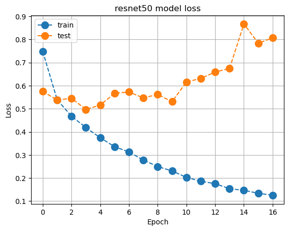

# Image-classification 

This project aims to use image classification using transfer learning with pre-trained models: VGG19, ResNet50, InceptionV3.

### Get started

Ensure that your **python** version is >= 3.9 

Train the model using the following command:

```bash
   $ cd src
   $ python train.py 
```

### Results 

* The pre-trained models seem to overfitting, and the baseline model for the cifar10 dataset can be enough.
* We can do data augmentation to improve the results.

Accuracy                              |  Loss                             
:------------------------------------:|:---------------------------------:
    |  
:------------------------------------:|----------------------------------:
    |  
:------------------------------------:|----------------------------------:
|  


### Classify the images

run the main script using the following command:

```bash
   $ cd src
   $ python main.py 
```

### Tensorboard
```bash
   $ tensorboard --logdir logs
```